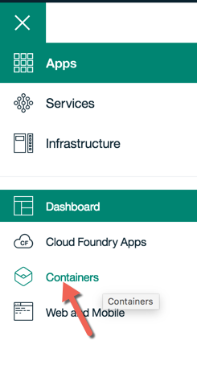
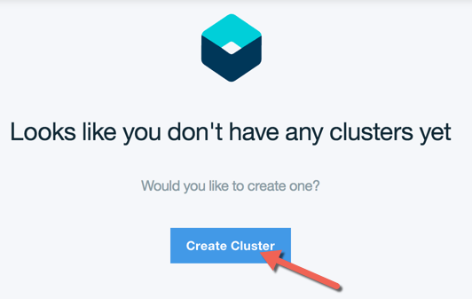
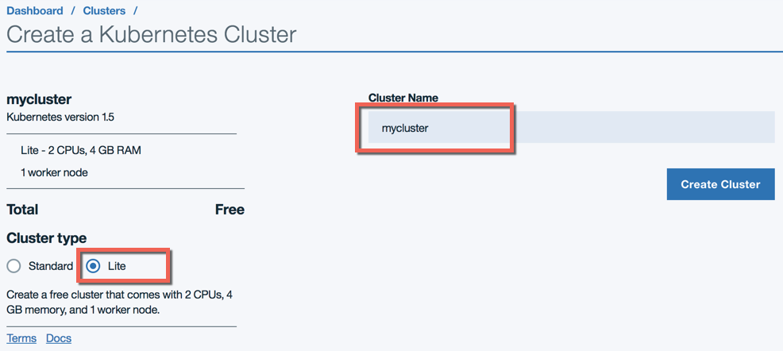
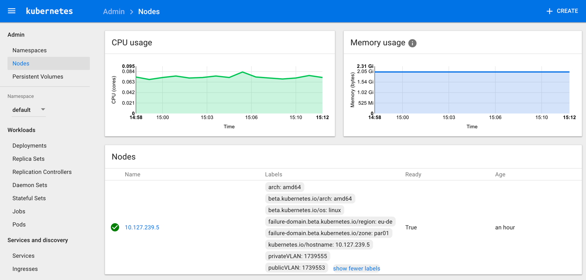

# Hands-on Kubernetes on IBM Cloud (PUBLIC)
Demo flows for IBM Developer Unconference, Zurich Aug 15-16 2017.

This guide will guide you trough some example devOps activities using a Kubernetes cluster in the IBM Cloud and a simple 'hello world' application using redis, which available as (public) container image on dockerhub https://hub.docker.com/r/faxg/hello-world-web/


## Prerequisites
Make sure you have the following:

* Working internet connection `¯\_(ツ)_/¯`
* Docker: http://docker.com
* Git: http://git-scm.org
* `kubectl` command line tool: https://kubernetes.io/docs/tasks/tools/install-kubectl/
* IBM Bluemix account / IBM ID: https://console.bluemix.net/
* IBM Bluemix command line tool (CLI) `bx`: https://clis.ng.bluemix.net/ui/home.html
* Install the IBM Container Service plugin into the Bluemix CLI:
`bx plugin install container-service -r Bluemix`

Please take note of the following, you'll need this info along your way:

* Your IBM ID (e.g. e-mail) + password.
* Know whether you use our Enterprise Single-Sign-On (SSO) service - authentication flow against http://www.bluemix.net will be slightly different. This is especially true for IBMers using their W3 intranet ID as IBM ID.
* We'll use the Bluemix region `eu-de`. You could try other Bluemix regions, but keep in mind you may have slightly different API endpoints, URLs etc.


## Setup cluster and configure command line tools
_"As an operator, I want to setup a Kubernetes development cluster in in the cloud in less than 10 minutes"_

**Browser**:
 1. Login to http://www.bluemix.net
 1. In the left hand menu on your dashboard, select "Containers" and create a new 'Lite' cluster. This will create a single Kubernetes worker node for you. We'll use `mycluster` as a name.







<!--
When using the IBM `bx` tool, auth token and cookie handling for the CLI client is simplifed. You could use plain & pure `kubectl`, but it's more cumbersome. See http://... for details.
-->

**Terminal**:
 1. Check `bx` version
 ```
  > bx --version
  bx version 0.5.5+87df0e64-2017-07-03T06:01:06+00:00
 ```
 1. Make sure the Bluemix plugin repository is configured:
 ```
 > bx plugin repos
 Listing added plug-in repositories...

 Repo Name   URL   
 Bluemix     http://plugins.ng.bluemix.net/   
 ```
 (only if the repo isn't there): Configure plugin repository
 ```
 > bx plugin repo-add Bluemix https://plugins.ng.bluemix.net
 ```
 1. Check `cs` (Container service) plugin is installed
 ```
 > bx plugin list
 Listing installed plug-ins...

 Plugin Name         Version   
 container-service   0.1.292   
 ...
 ```
 (if not installed: `bx plugin install container-service -r Bluemix`)

 1. Login to Bluemix:
 ```
 > bx login -a https://api.eu-de.bluemix.net
 API endpoint:   https://api.eu-de.bluemix.net (API version: 2.75.0)   
Region:         eu-de   
User:           Florian.Georg@ch.ibm.com   
Account:        Florian Georg's Account (d2e4199a0d836bf40695d704dcde817d)   
Org:            Florian Georg - demo   
Space:          dev   
 ```
 Note: Make sure to use the correct API endpoint for the region where you created your cluster. (eu-de in our case).

 1. Init your container service plugin (if needed):
```
> bx cs init
Using default API endpoint: https://eu-central.containers.bluemix.net
```

 1. Check if your cluster is already up&running:
 ```
 > bx cs clusters
 Name        ID                                 State    Created                    Workers   Datacenter   
 mycluster   9a97e1a95e39435b8265334e7d550bdf   normal   2017-08-15T11:57:10+0000   1         par01   
 ```

 1. Check your worker node:
 ```
 > bx cs workers mycluster
 ID                                                 Public IP       Private IP     Machine Type   State    Status   
kube-par01-pa9a97e1a95e39435b8265334e7d550bdf-w1   169.51.10.229   10.127.239.5   free           normal   Ready   

 ```

 1. Check available locations and machine types
 ```
 > bx cs locations
 Location   
 ams03   
 fra02   

 > bx cs machine-types fra02
 Name         Cores   Memory   Network Speed   OS             Storage   Server Type   
u1c.2x4      2       4GB      1000Mbps        UBUNTU_16_64   100GB     virtual   
b1c.4x16     4       16GB     1000Mbps        UBUNTU_16_64   100GB     virtual   
b1c.16x64    16      64GB     1000Mbps        UBUNTU_16_64   100GB     virtual   
b1c.32x128   32      128GB    1000Mbps        UBUNTU_16_64   100GB     virtual   
b1c.56x242   56      242GB    1000Mbps        UBUNTU_16_64   100GB     virtual   
 ```

1. In order to use the `kubectl` CLI tool, we need to download and configure certificates and config data:
```
> bx cs cluster-config mycluster
The configuration for mycluster was downloaded successfully. Export environment variables to start using Kubernetes.
export KUBECONFIG=/Users/florian/.bluemix/plugins/container-service/clusters/mycluster/kube-config-par01-mycluster.yml
```  

Please execute the `export` command as output on the console. As you can see the `KUBECONFIG` environment variable needs to point to the right cluster configuration file. Keep this in mind when targeting different clusters with your kubectl client.

1. Run the dashboard on your localhost, proxying to your remote cluster:
```
> export KUBECONFIG=/Users/florian/.bluemix/plugins/container-service/clusters/mycluster/kube-config-par01-mycluster.yml
> kubectl proxy
Starting to serve on 127.0.0.1:8001
```


 **Browser**:
 + Access your dashboard on `http://127.0.0.1:8001/ui`:

 

 + Have a look at Nodes, Namespaces and Workloads.


 All done. Your local `kubectl` tool should now target the correct Kubernetes cluster in the IBM Cloud.


## Deploy example application
_"As a devOps engineer, I want to deploy a sample application using public images from dockerhub into my development cluster"_


**Terminal**:
1. Deploy version 1.0.0. We can apply a whole directory containing our resources as `.yaml` files.
```
kubectl apply -f resources/1.0.0/
```
1.
1.


Please note that exposing your service using ClusterIP / NodePort does not actually deploy a loadbalancer or reverse proxy (such as nginx) in front of your pod replicas. This
is rather a `kube-proxy`configuration.
Kubernetes has another resource type called horizontal  

## Deploy an application change
_"As a devOps engineer, I want to deploy a new image version (1.0.1) of the web UI into my development cluster - without downtime and the ability to rollback changes to the previous, stable deployment"_


<!--## Deploy a "breaking" change to the database
_"As a devOps engineer, I want to deploy "_
-->

## Promote deployment into "Production"
_"As an operator, I want to promote the deployed application version from 'development' into 'production' without downtime, so that it is instantly exposed to application users under a stable, 'production' URL"_

*Note*: In the real (Enterprise IT) world, we would probably have different kubernetes clusters for a true isolation between 'dev' and 'production' environments. This is a tradeoff between the idealized '_dev/prod environment parity_' and Enterprise IT policies that may be subject to strict corporate security guidelines and/or regulatory requirements for operational risk management (e.g. in the Banking/FSS industry).


## FAQ

## Links
* Presentation: Intro to Kubernetes and IBM Cloud private

* Lionel Mace's Bluemix lab on Kubernetes https://github.com/lionelmace/bluemix-labs/tree/master/labs/Lab%20Kubernetes%20-%20Orchestrate%20your%20docker%20containers
